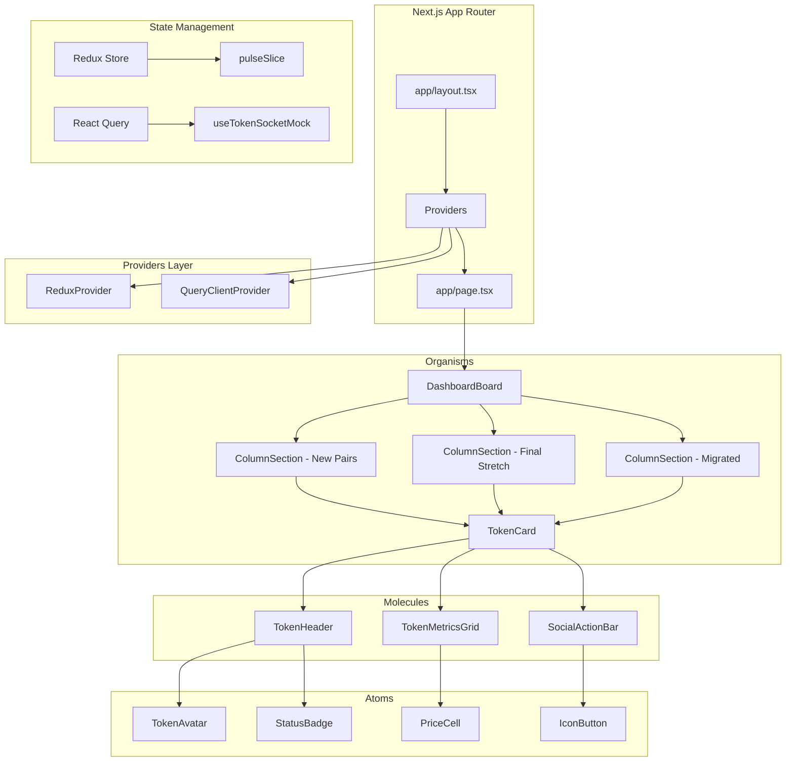

# Design Document

## Overview

The Axiom Pulse Token Discovery Table is a real-time crypto dashboard built with Next.js 14 (App Router). It displays token data across three categorized columns with simulated WebSocket updates. The architecture follows atomic design principles with a hybrid state management approach using Redux Toolkit for UI state and React Query for server state.

## Architecture



## Components and Interfaces

### Directory Structure

```
src/
├── app/
│   ├── layout.tsx
│   ├── page.tsx
│   └── globals.css
├── components/
│   ├── atoms/
│   │   ├── TokenAvatar.tsx
│   │   ├── StatusBadge.tsx
│   │   ├── PriceCell.tsx
│   │   └── IconButton.tsx
│   ├── molecules/
│   │   ├── TokenHeader.tsx
│   │   ├── TokenMetricsGrid.tsx
│   │   └── SocialActionBar.tsx
│   └── organisms/
│       ├── TokenCard.tsx
│       ├── ColumnSection.tsx
│       └── DashboardBoard.tsx
├── hooks/
│   └── useTokenSocketMock.ts
├── store/
│   ├── index.ts
│   ├── provider.tsx
│   └── slices/
│       └── pulseSlice.ts
├── lib/
│   ├── utils.ts
│   ├── formatters.ts
│   └── tokenGenerator.ts
└── types/
    └── token.ts
```

### Type Definitions

```typescript
// types/token.ts
export interface Token {
  id: string;
  name: string;
  symbol: string;
  avatarUrl: string;
  price: number;
  priceChange: number; // percentage
  marketCap: number;
  marketCapChange: number; // percentage
  bondingCurve: number; // 0-100 percentage
  userPercentage: number;
  chefPercentage: number;
  transactions: number;
  volume: number;
  holders: number;
  createdAt: Date;
  migratedAt?: Date;
  category: 'new-pairs' | 'final-stretch' | 'migrated';
  flashState?: 'green' | 'red' | null;
}

export type PresetType = 'P1' | 'P2' | 'P3';
export type SortMethod = 'time' | 'marketCap' | 'volume' | 'holders';

export interface PulseState {
  activePreset: PresetType;
  sortingMethod: SortMethod;
  filters: {
    minMarketCap?: number;
    maxMarketCap?: number;
    minHolders?: number;
  };
}
```

### Atom Components

#### TokenAvatar
```typescript
interface TokenAvatarProps {
  src: string;
  alt: string;
  size?: 'sm' | 'md';
  onClick?: () => void;
}
```
- Displays circular token image (32x32px)
- Shows camera overlay icon on hover
- Triggers Dialog modal on click
- Uses Shadcn Dialog component

#### StatusBadge
```typescript
interface StatusBadgeProps {
  label: string;
  value: number;
  variant: 'user' | 'chef' | 'bonding';
}
```
- Pill-shaped badge with label and percentage
- Bonding variant shows Tooltip on hover with "Bonding: XX.XX%"
- Uses Shadcn Tooltip component

#### PriceCell
```typescript
interface PriceCellProps {
  value: number;
  change?: number;
  flashState?: 'green' | 'red' | null;
  format?: 'currency' | 'marketCap';
}
```
- Displays formatted price/market cap
- Green (#22c55e) for positive, Red (#ef4444) for negative
- Flash animation on update (200ms background pulse)
- Uses CSS transitions for smooth flash effect

#### IconButton
```typescript
interface IconButtonProps {
  icon: LucideIcon;
  onClick?: () => void;
  tooltip?: string;
  size?: 'sm' | 'md';
}
```
- Renders Lucide icon with hover state
- Optional tooltip on hover
- Consistent sizing (16x16 or 20x20)

### Molecule Components

#### TokenHeader
```typescript
interface TokenHeaderProps {
  token: Token;
  onAvatarClick: () => void;
}
```
- Combines TokenAvatar + name/symbol + StatusBadges
- Layout: Avatar | Name/Symbol | Badges row
- Tight horizontal spacing

#### TokenMetricsGrid
```typescript
interface TokenMetricsGridProps {
  price: number;
  priceChange: number;
  marketCap: number;
  marketCapChange: number;
  transactions: number;
  volume: number;
  holders: number;
  flashState?: 'green' | 'red' | null;
}
```
- 2-column grid layout for metrics
- Labels in muted color (#71717a)
- Values with appropriate formatting (K, M, B suffixes)
- Price and MarketCap use PriceCell with flash support

#### SocialActionBar
```typescript
interface SocialActionBarProps {
  createdAt: Date;
  onUserClick?: () => void;
  onGlobeClick?: () => void;
  onSearchClick?: () => void;
}
```
- Displays relative time (e.g., "2m", "1h", "3d")
- Row of IconButtons: User, Globe, Search
- Right-aligned action icons

### Organism Components

#### TokenCard
```typescript
interface TokenCardProps {
  token: Token;
}
```
- Wraps TokenHeader + TokenMetricsGrid + SocialActionBar
- Background: #09090b, hover: #18181b
- Border: 1px solid zinc-800
- Fixed height to prevent layout shift
- Wrapped in React.memo for performance
- Padding: 8px (p-2)

#### ColumnSection
```typescript
interface ColumnSectionProps {
  title: string;
  tokens: Token[];
  category: Token['category'];
}
```
- Column header with title and count badge
- Scrollable token list (max-height with overflow-y-auto)
- Handles sorting based on category rules

#### DashboardBoard
```typescript
interface DashboardBoardProps {}
```
- 3-column CSS Grid layout (desktop)
- Stacked layout (mobile < 768px)
- Consumes tokens from useTokenSocketMock
- Distributes tokens to ColumnSections by category

## Data Models

### Token Generation (Faker.js)

```typescript
// lib/tokenGenerator.ts
function generateToken(category: Token['category']): Token {
  return {
    id: faker.string.uuid(),
    name: faker.finance.currencyName(),
    symbol: faker.finance.currencyCode(),
    avatarUrl: faker.image.avatar(),
    price: faker.number.float({ min: 0.0001, max: 100, fractionDigits: 4 }),
    priceChange: faker.number.float({ min: -10, max: 10, fractionDigits: 2 }),
    marketCap: faker.number.int({ min: 10000, max: 10000000 }),
    marketCapChange: faker.number.float({ min: -5, max: 5, fractionDigits: 2 }),
    bondingCurve: category === 'final-stretch' 
      ? faker.number.int({ min: 80, max: 99 })
      : faker.number.int({ min: 0, max: 79 }),
    userPercentage: faker.number.int({ min: 0, max: 100 }),
    chefPercentage: faker.number.int({ min: 0, max: 100 }),
    transactions: faker.number.int({ min: 10, max: 50000 }),
    volume: faker.number.int({ min: 1000, max: 5000000 }),
    holders: faker.number.int({ min: 10, max: 10000 }),
    createdAt: faker.date.recent({ days: 7 }),
    migratedAt: category === 'migrated' ? faker.date.recent({ days: 1 }) : undefined,
    category,
    flashState: null,
  };
}
```

### Redux Store Structure

```typescript
// store/slices/pulseSlice.ts
const initialState: PulseState = {
  activePreset: 'P1',
  sortingMethod: 'time',
  filters: {},
};

const pulseSlice = createSlice({
  name: 'pulse',
  initialState,
  reducers: {
    setActivePreset: (state, action: PayloadAction<PresetType>) => {
      state.activePreset = action.payload;
    },
    setSortingMethod: (state, action: PayloadAction<SortMethod>) => {
      state.sortingMethod = action.payload;
    },
    setFilters: (state, action: PayloadAction<PulseState['filters']>) => {
      state.filters = action.payload;
    },
  },
});
```

## Real-Time Simulation Hook

```typescript
// hooks/useTokenSocketMock.ts
function useTokenSocketMock() {
  const [tokens, setTokens] = useState<Token[]>([]);
  
  // Initialize with 30 tokens (10 per category)
  useEffect(() => {
    const initial = [
      ...Array(10).fill(null).map(() => generateToken('new-pairs')),
      ...Array(10).fill(null).map(() => generateToken('final-stretch')),
      ...Array(10).fill(null).map(() => generateToken('migrated')),
    ];
    setTokens(initial);
  }, []);
  
  // Price updates every 1000ms
  useEffect(() => {
    const interval = setInterval(() => {
      setTokens(prev => {
        const updated = [...prev];
        // Update 3-5 random tokens
        const updateCount = Math.floor(Math.random() * 3) + 3;
        for (let i = 0; i < updateCount; i++) {
          const idx = Math.floor(Math.random() * updated.length);
          const change = (Math.random() - 0.5) * 0.01; // +/- 0.5%
          updated[idx] = {
            ...updated[idx],
            price: updated[idx].price * (1 + change),
            priceChange: change * 100,
            flashState: change > 0 ? 'green' : 'red',
          };
        }
        return updated;
      });
      
      // Clear flash states after 200ms
      setTimeout(() => {
        setTokens(prev => prev.map(t => ({ ...t, flashState: null })));
      }, 200);
    }, 1000);
    
    return () => clearInterval(interval);
  }, []);
  
  // New token every 5000ms
  useEffect(() => {
    const interval = setInterval(() => {
      setTokens(prev => [generateToken('new-pairs'), ...prev]);
    }, 5000);
    
    return () => clearInterval(interval);
  }, []);
  
  return { tokens };
}
```

## Error Handling

### Data Validation
- Token data validated on generation using Zod schemas (optional enhancement)
- Fallback values for missing/invalid data
- Graceful degradation if avatar image fails to load

### State Management Errors
- Redux actions wrapped in try-catch where needed
- React Query error boundaries for data fetching failures
- Console warnings for development debugging

### UI Error States
- Empty state for columns with no tokens
- Loading skeleton during initial data generation
- Error boundary at DashboardBoard level

## Testing Strategy

### Unit Tests
- Token generator produces valid Token objects
- Formatters correctly abbreviate numbers (K, M, B)
- Redux reducers update state correctly
- PriceCell displays correct colors based on change value

### Component Tests (React Testing Library)
- TokenCard renders all required elements
- StatusBadge shows tooltip on hover
- TokenAvatar opens dialog on click
- ColumnSection sorts tokens correctly by category

### Integration Tests
- useTokenSocketMock updates tokens at correct intervals
- Flash states appear and disappear correctly
- New tokens appear at top of New Pairs column
- Redux preset changes filter displayed tokens

### Visual Regression Tests (Optional)
- Snapshot tests for TokenCard in various states
- Responsive layout tests at 320px, 768px, 1024px breakpoints

### Performance Tests
- Verify React.memo prevents unnecessary re-renders
- Measure render time with 30+ tokens updating
- Check for layout shift (CLS) during updates
